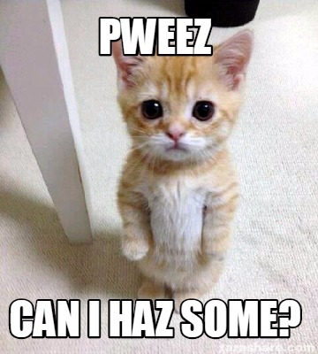

# Hack-Along

We’ve been conditioned to believe in the myth on natural competition: the survival of the fittest. In this view, each one of us struggles against all the others for scarce resources. The strongest ones survive and pass on their  genes, while the weak deserve to lose and die out. Outside of our family environment, this way of thinking seems to be reflected in in everything we do.

However, nature is much more about collaboration than competition. The very concept of an ecosystem brings every piece of the puzzle in harmonious interconnection.

We need a fresh new modus-operandi which starts from a sharing and collaborative endeavours. This is the key ideology behind hack-alongs.

## So what's an Hack-Along?

An hack-along is prescriptively non-prescriptive, so it is quite difficult to give a straight answer to this question.

Every participant should follow their bliss and not be bound to any pre-requisites they did not choose for.


**Rules** are coercive by nature. They are decisions taken by a small group of people that are aimed to affect a greater group. They often come in bulk, they tend to be very difficult to change. You are generally not able to consent to a few rules while rejecting others. As such, it is not advisable to use them.


There is an experimented list of patters that participant have successfully used, so we can list a few here for you to pick up. Every person, group and location running an hack-along chooses which patterns to adopt, or can propose new ones.

### The hack-along principles

Any one can come up with values that holds them together, the only dictatorship we allow is the physical reality. Hack-along projects are to be grounded on this physical reality and aimed at aiding people to co-live, co-create, and thrive!

In general  hack-alongs follow these principles:

**Consent over Consensus:** we don't need to agree on everything. If 49% disagrees on something, they shouldn't be forced to do it because "the majority" wants the opposite.  
  
**Non-coercive:** no-one can tell participants what to do and when, unless they consent to that.

**Intrinsically Motivated Contributions:**  every contribution is strengthen by the motivation that only you and your life experience can. Follow your bliss, fix the issue you want to see fixed in the world.

**Globally Synchronous, Locally Asynchronous:** Everyone choose what and when and where to do it, but we do have specific moments in which everyone show and tells. We align the release cycles at full moon and new moon, which is the same everywhere in the world! ****

**Natural laws:** use biomimicry in everything we do, ****these laws are indisputable. These are indisputable, and recognised at the global level , so we try to link everything to them. Can you find a loop in nature? There is the day and night, there is the lunar cycle. So let's key natural phenomenas to synchronise our global efforts!

### Find a project you like, or start a new one!

Hack-along projects tend to focus on the co-creation of tools and technologies for sharing and collaborating, and thriving but anything that is open and useful for the planet and the people living on it will do!

You find and join projects that match your vision of the future, and help them out how only you can. You don't need to ask permissions, just pick up anything and use your skills to improve on the works of others, when existing contributors recognise your contributions you will automatically be part of the team!

Do you have a great idea or project yourself? Then you can just propose it and if people also think it is great, they will help you out!

```
$ give me hack-along rules!
```



No you little one, we are  not here to tell you what to do. We really really want you to find out by yourself, because when it is you that decide what to do, you will be able go at warp speed, and won't need anyone to tell you what to do, or wait for anyone to complete his task.

But we can surely help you find your way around if you need us! Ask for help on our telegram group, or loose yourself in the deepest corners of our [forum](https://async.hackalong.io/). Explore some of the patterns which attract you, and see who likes them too... you will already have something in common to hack-along ;-\)

